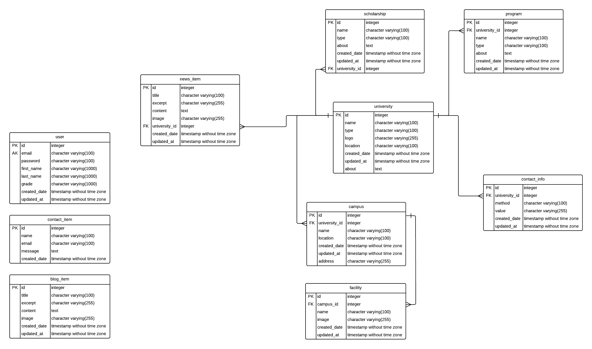

University Guide
===
### Project Description
This website should serve as a university guide for students looking to get a higher education to find the suitable university for their situation.
### URL
https://university-guide-fp.herokuapp.com/

### Pages
#### 1. Homepage
The main landing page.

It consists of:
- Search
- Featured universities.
- Latest News
- Latest blog posts

#### 2. Universities
A page that lists all universities.

#### 3. Contact us
A page to allow users to submit feedback and inquiries.

#### 4. Register
A page that allows user to register.

#### 5. Login
A page that allows user to login.

#### To do list:
[ ] Build single university page 

[ ] Add pagination to universities page

### ERD


> The website is seeded with dummy data and lots of kitties because I don't have actual data yet, but you can test the search by looking for CODE.

## Running Locally
> You will need to populate .env file with your database, and secret keys.
> 
> Example .env is provided 

To migrate 
```shell
flask db upgrade
```

To seed the database 
```shell
flask seed run
```

To run the project
```shell
flask run
```
